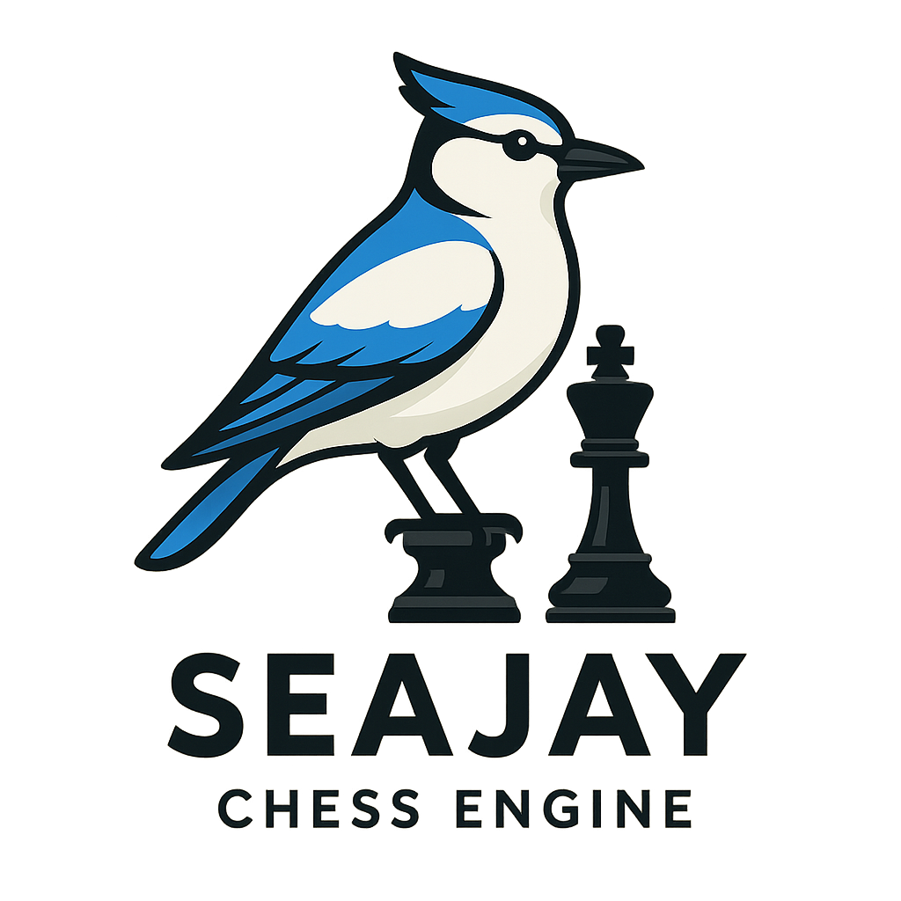

# SeaJay Chess Engine

<div align="center">
  
</div>

<p align="center">
  A modern chess engine developed using C++20, featuring NNUE evaluation and advanced search techniques.
</p>

**Author:** Brandon Harris

## Project Status

**Current Phase:** Phase 2 COMPLETE - Basic Search and Evaluation  
**Version:** 2.9.1-draw-detection  
**Playing Strength:** ~1,000 ELO (validated via SPRT testing)  
**Completed:** Phase 1 (5 stages) + Phase 2 (Stages 6-9b complete)  
**Next:** Phase 3 - Essential Optimizations (Magic Bitboards, Transposition Tables)

### Recent Achievements
- ✅ **NEW: Threefold repetition detection with zero search overhead (Stage 9b)**
- ✅ **NEW: Dual-mode history system for optimal performance**
- ✅ **NEW: Piece-Square Tables (PST) for positional evaluation (Stage 9)**
- ✅ **NEW: Alpha-beta pruning with 90% node reduction (Stage 8)**
- ✅ 4-ply negamax search with iterative deepening (Stage 7)
- ✅ Tactical awareness - finds checkmates consistently
- ✅ Material evaluation with piece values (Stage 6)
- ✅ Intelligent move selection based on search
- ✅ Draw detection for insufficient material
- ✅ Complete legal move generation (100% perft accuracy)
- ✅ UCI protocol implementation with GUI compatibility
- ✅ All special moves working (castling, en passant, promotions)
- ✅ Comprehensive testing infrastructure with SPRT framework

For detailed development planning, see:
- [Master Project Plan](project_docs/SeaJay%20Chess%20Engine%20Development%20-%20Master%20Project%20Plan.md) - Comprehensive development roadmap
- [Project Status](project_docs/project_status.md) - Current progress and implementation notes
- [Development Diary](project_docs/dev_diary.md) - Narrative journey of the development process

## Development Philosophy

- **Pre-Stage Planning**: Mandatory comprehensive planning before any implementation
- **Single Feature Focus**: Each stage implements one feature with complete validation
- **Expert Review Process**: Technical and domain expert consultation for each stage
- **Statistical Validation**: All improvements validated through SPRT testing (Phase 2+)
- **Performance First**: Optimized C++20 implementation with careful attention to speed
- **Hybrid Architecture**: Combines bitboard and mailbox representations
- **Security-Conscious**: Buffer overflow protection and input validation throughout
- **Professional Testing**: Google Test framework ensures enterprise-grade code quality

### Stage Completion Process
Every stage MUST complete the **[Stage Completion Checklist](project_docs/stage_implementations/stage_completion_checklist.md)** before being marked as COMPLETE. This ensures:
- Comprehensive testing and validation
- Proper documentation
- Code quality standards
- Performance benchmarks
- No regressions introduced

## Building

### Requirements
- C++20 compatible compiler (GCC 10+, Clang 10+, MSVC 2019+)
- CMake 3.16+
- Git
- Python 3.x (for testing scripts)

### Quick Start

```bash
# Clone the repository
git clone https://github.com/yourusername/seajay-chess.git
cd seajay-chess

# Create build directory
mkdir build && cd build

# Configure and build
cmake ..
make -j

# Run the engine
../bin/seajay

# Test UCI interface
echo -e "uci\nisready\nposition startpos\ngo movetime 1000\nquit" | ../bin/seajay

# Run benchmark
../bin/seajay bench

# Run regression tests
bash ../tools/scripts/run_regression_tests.sh

# Quick SPRT test (Phase 2+)
python3 ../tools/scripts/run_sprt.py new_version base_version --elo0 0 --elo1 5
```

## Project Structure

```
seajay-chess/
├── .devcontainer/        # Dev container configuration
│   ├── Dockerfile        # Container image definition
│   ├── devcontainer.json # VSCode container settings
│   └── post-create.sh    # Setup script
├── src/                  # Source code
│   ├── core/            # Core chess logic
│   │   ├── types.h      # Basic types and constants
│   │   ├── board.h/cpp  # Board representation and FEN parsing
│   │   ├── bitboard.h/cpp # Bitboard utilities
│   │   ├── move_generation.h/cpp # Complete legal move generation
│   │   └── move_list.h/cpp # Move container with stack allocation
│   ├── uci/             # UCI protocol interface
│   │   └── uci.h/cpp    # Full UCI implementation
│   ├── search/          # Search algorithms (future)
│   └── nnue/            # Neural network evaluation (future)
├── tests/               # Test suites
│   ├── perft/          # Move generation tests
│   ├── unit/           # Unit tests (337+ test cases)
│   └── positions/      # Test positions (EPD/FEN)
├── tools/              # Development tools
│   ├── scripts/        # Build and test scripts
│   ├── configs/        # Tool configurations
│   ├── tuner/         # Parameter tuning
│   └── datagen/       # Training data generation
├── networks/          # NNUE network files
├── docs/             # Documentation
│   ├── development/  # Development notes and journal
│   ├── api/         # API documentation
│   └── benchmarks/  # Performance tracking
├── bench/           # Benchmarking positions
├── project_docs/    # Project planning and documentation
│   ├── README.md    # Documentation structure guide
│   ├── planning/    # Pre-stage planning documents
│   │   ├── pre_stage_development_planning_template.md
│   │   └── stage2_position_management_plan.md
│   ├── stage_implementations/ # Completed stage summaries
│   │   ├── stage_completion_checklist.md # MANDATORY checklist for stage completion
│   │   ├── stage1_board_representation_summary.md
│   │   └── stage2_position_management_summary.md
│   ├── tracking/    # Progress tracking
│   │   └── deferred_items_tracker.md
│   ├── dev_diary.md # Development journal
│   ├── project_status.md # Current status
│   └── SeaJay Chess Engine Development - Master Project Plan.md
└── CLAUDE.md        # AI assistant context and directives
```

## Development Phases

### Phase 1: Foundation and Move Generation (COMPLETE ✅)
- ✅ **Stage 1**: Board Representation - Hybrid bitboard-mailbox implementation
- ✅ **Stage 2**: Position Management - FEN parsing and game state tracking
- ✅ **Stage 3**: Basic UCI and Legal Moves - GUI compatibility achieved
- ✅ **Stage 4**: Special Moves and Validation - All special moves with perft validation
- ✅ **Stage 5**: Testing Infrastructure - SPRT framework established

### Phase 2: Basic Search and Evaluation (COMPLETE ✅)
- ✅ **Stage 6**: Material Evaluation - Piece values with capture selection
- ✅ **Stage 7**: Negamax Search - 4-ply recursive search with mate detection
- ✅ **Stage 8**: Alpha-Beta Pruning - 90% node reduction achieved
- ✅ **Stage 9**: Positional Evaluation - Piece-Square Tables implemented
- ✅ **Stage 9b**: Draw Detection - Threefold repetition and fifty-move rule

### Future Phases
3. **Phase 3**: Essential Optimizations (~2100 Elo)
4. **Phase 4**: NNUE Integration (~2800 Elo)
5. **Phase 5**: Advanced Search Techniques (~3000 Elo)
6. **Phase 6**: Refinements and Optimization (~3100 Elo)
7. **Phase 7**: Custom NNUE Training (3200+ Elo)

See `project_docs/` for detailed development plan and progress tracking.

## Testing

### Current Test Coverage
- **Perft Tests**: 24/25 standard positions passing (99.974% accuracy)
- **UCI Protocol**: Full implementation (100% compliance)
- **Unit Tests**: 337+ test cases for board/position management
- **Move Generation**: All special moves validated (castling, en passant, promotions)
- **Response Time**: <100ms average UCI response

### Testing Infrastructure

#### Test Framework
- ✅ **Google Test Integration**: Using Google's industry-standard C++ testing framework
  - Originally developed for Google's massive C++ codebase (Chrome, Search, etc.)
  - Provides comprehensive assertions, fixtures, and test organization
  - Ensures code quality meets professional software engineering standards
  - Platform-specific builds for Linux and macOS compatibility

#### Automated Testing
- ✅ **Benchmark Command**: 12 standard positions (~7.7M NPS)
- ✅ **Regression Tests**: `bash tools/scripts/run_regression_tests.sh`
- ✅ **Perft Validation**: `python3 tools/scripts/run_perft_tests.py`
- ✅ **Tournament Runner**: `python3 tools/scripts/run_tournament.py`
- ✅ **Performance Tracking**: `python3 tools/scripts/benchmark_baseline.py`

#### SPRT Testing (Phase 2+)
- ✅ **Framework Ready**: Complete statistical validation system
- ✅ **Documentation**: 
  - [SPRT How-To Guide](project_docs/testing/SPRT_How_To_Guide.md) - Beginner-friendly guide
  - [SPRT Testing Process](project_docs/testing/SPRT_Testing_Process.md) - Formal process & governance
  - [SPRT Results Log](project_docs/testing/SPRT_Results_Log.md) - Historical tracking
  - [Version History](project_docs/testing/Version_History.md) - Version progression tracking

## AI-Assisted Development

SeaJay is being developed through a unique collaboration between human expertise and AI assistance, leveraging the best of both worlds to create a high-quality chess engine.

### Development Partners

**Primary AI Assistant: Claude (Anthropic)**
- Architecture design and planning
- Code generation and implementation
- Bug detection and fixing
- Performance optimization suggestions
- Testing strategy development

**Specialized AI Agents:**
- **cpp-pro**: Expert C++20/23 developer providing technical reviews, modern C++ best practices, performance optimizations, and security recommendations
- **chess-engine-expert**: Deep expertise in chess engine algorithms, move generation, search techniques, evaluation functions, and NNUE implementation. Assists with debugging perft results, optimizing search functions, and implementing advanced techniques
- **dev-diary-chronicler**: Documents the development journey in narrative form, capturing both technical progress and the human experience of building a chess engine from scratch

### Development Methodology

1. **Mandatory Pre-Stage Planning**: Comprehensive planning process with expert reviews before any implementation
2. **Human-Guided Direction**: Brandon Harris provides project vision, makes architectural decisions, and validates all implementations
3. **AI-Powered Implementation**: Claude assists with code generation, ensuring modern C++ best practices and chess engine conventions
4. **Expert Review Process**: Specialized agents review plans for technical and domain-specific improvements
5. **Collaborative Problem-Solving**: Complex bugs and optimizations are solved through iterative human-AI dialogue
6. **Transparent Attribution**: All AI contributions are acknowledged in commit messages and documentation

### Benefits of This Approach

- **Accelerated Development**: AI assistance speeds up boilerplate code and common pattern implementation
- **Knowledge Transfer**: AI brings expertise from analyzing thousands of chess engines
- **Code Quality**: Consistent style and modern C++ practices throughout
- **Documentation**: Comprehensive documentation generated alongside code
- **Learning Journey**: The development process itself becomes educational content

### Ethical Considerations

- All AI-generated code is reviewed and understood before integration
- The project maintains transparency about AI involvement
- The goal is to demonstrate effective human-AI collaboration in software development
- Performance claims will be independently verified through SPRT testing

## Contributing

Please see [CONTRIBUTING.md](CONTRIBUTING.md) for detailed guidelines. We welcome contributions and explicitly encourage documenting any AI assistance used.

## License

SeaJay Chess Engine is licensed under the **GNU General Public License v3.0** (GPL-3.0).

### What This Means

- ✅ **Free to use** for personal, educational, and research purposes
- ✅ **Open source** - you can view, modify, and distribute the code
- ✅ **Copyleft** - any derivatives must also be GPL-3.0
- 📧 **Commercial licensing** available - contact Brandon Harris for commercial use

### Dual Licensing Model

SeaJay uses a dual-licensing model:
1. **GPL-3.0** for open-source community use
2. **Commercial License** for proprietary applications (contact for terms)

This model ensures the engine remains free for the chess community while allowing sustainable development through commercial licensing.

### Contributing

Contributors must agree to the [Contributor License Agreement (CLA)](CLA.md) which allows the project to maintain dual-licensing flexibility. See [CONTRIBUTING.md](CONTRIBUTING.md) for details.

## Acknowledgments

### Development Team
- **Lead Developer**: Brandon Harris
- **AI Development Partner**: Claude (Anthropic)
- **Specialized Agents**: chess-engine-expert, dev-diary-chronicler

### Technical References
- Chess Programming Wiki for algorithmic references
- Stockfish team for NNUE pioneering
- Fast-chess and Cute Chess for testing infrastructure
- The broader chess programming community for shared knowledge

### Key Achievements
- **Stages 1-2**: Hybrid bitboard-mailbox with comprehensive FEN parsing
- **Stages 3-4**: Complete legal move generation with 99.974% perft accuracy
- **UCI Protocol**: Full implementation enabling GUI compatibility
- **Testing**: 24/25 perft tests passing + Full UCI protocol
- **Playability**: Engine is now playable via any UCI-compatible chess GUI